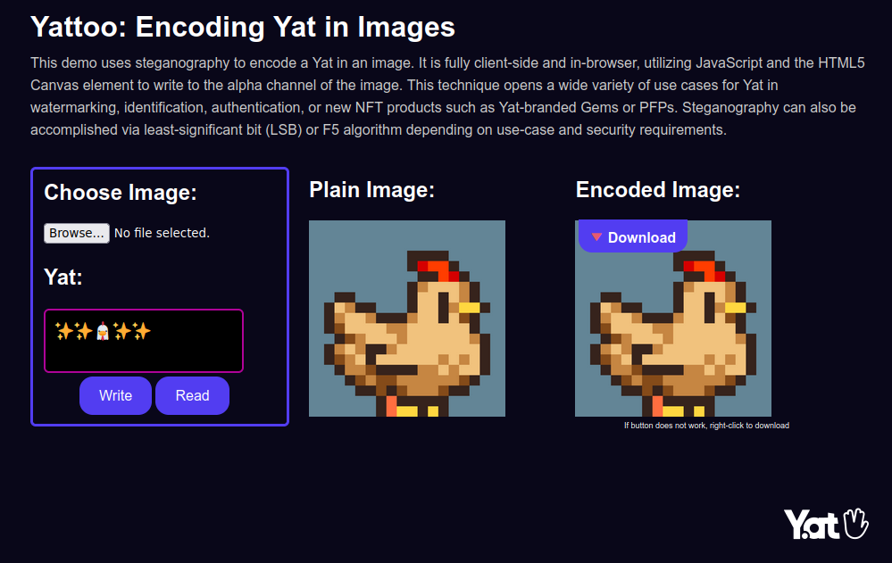

# Yattoo: Encoding Yat in Images

Embed a Yat into an image using steganography techniques

This demo uses steganography to encode a [Yat](https://y.at) in an image. It is fully client-side and in-browser, utilizing JavaScript and the HTML5 Canvas element to write to the alpha channel of the image. This technique opens a wide variety of use cases for Yat in watermarking, identification, authentication, or new NFT products such as Yat-branded Gems or PFPs.

### What is steganography?

[Steganography](https://en.wikipedia.org/wiki/Steganography) is the practice of concealing information within text, images, sound, or video. You can encode a hidden message inside a file by concealing a pattern in the data or the metadata.

### Why use steganography?

Information hidden with steganography is easy to extract, if you are aware of its existence. A person's Yat can be embedded inside their artwork, for example, and used as the artist's signature. Apps can read this Yat identity and attribute the artwork to the artist.

Steganography may also be used alongside cryptography to strengthen the confidentiality and integrity of information. Messages hidden by steganography techniques do not immediately attract attention and those messages can, in turn, be encrypted and verifiable. Data can be hidden "in plain view", so to speak, and the author or owner can be confirmed.

## How it works

This demo uses an algorithm to covert a text string to binary data that is hidden in the alpha channel of an image file. You can think of it as a background layer that contains a Yat, with the original image layered on top as a new file. To read the embedded Yat from this file, a similar algorithm is applied.

## Using Yat steganography

Potential use cases are: 

* Signing artwork with your Yat
* Embedding your Yat in profile pics
* Linking your Yat to NFT collections
* Mentioning friends in memes
* "Scavenger hunt"-style games
* Awards and badges
* Encoding secret messages for specific Yat owners
* Generative NFTs linked to Yat identity
* Identifying clones, remixes, and counterfeit NFTs
* Conveying authorship and licensing terms

All of these use cases require development beyond this simple demo, which uses the [steganography.js](https://github.com/petereigenschink/steganography.js/) library. Additional hashing and cryptography techniques would be needed for use cases that require strong confidentiality and verification of identity.

### Additional methods

Steganography can also be accomplished via least-significant bit (LSB) or F5 algorithm depending on the use case and security requirements. For JavaScript implementations, see [this LSB example](https://github.com/thavixt/steganography-js) and [this F5 example](https://github.com/desudesutalk/f5stegojs).

### In the wild
[CjS77](https://github.com/CjS77) describes an [excellent example](https://github.com/tari-labs/yat-steganography/issues/1) of steganography usage within an [NFT collection](https://opensea.io/collection/seven-5iwat2ntvf). As this example proves, steganography can be used not only for an artist's signature but also to identify clones, remixes, or counterfeit NFTs.

## Licensing

These materials are ethical Free and Open Source Software (FOSS).

* [Steganography.js](https://github.com/petereigenschink/steganography.js/) is authored by [Peter Eigenschink](http://www.peter-eigenschink.at/) and released under the [MIT/Expat license](https://spdx.org/licenses/MIT.html).
* Any and all original work contained in this repository is copyright &copy; 2023 Tari Labs and released under the BSD 3-Clause License. See [LICENSE](LICENSE) for more information.

