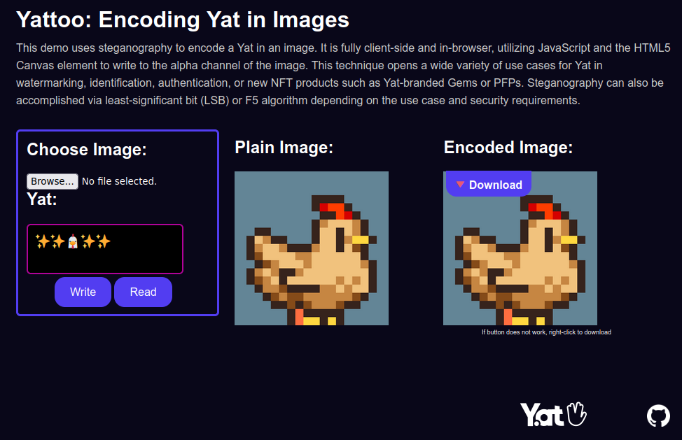

# Yattoo: Encoding Yat in Images

This demo uses steganography to encode a [Yat](https://y.at) in an image. It is fully client-side and in-browser, utilizing JavaScript and the HTML5 Canvas element to write to the alpha channel of the image. This technique opens a wide variety of use cases for Yat in watermarking, identification, authentication, or new NFT products such as Yat-branded Gems or PFPs. Steganography can also be accomplished via least-significant bit (LSB) or F5 algorithm depending on use-case and security requirements.

## Licensing

These materials are ethical Free and Open Source Software (FOSS). Any and all original work contained in this repository is copyright &copy; 2023 Tari Labs and released under the BSD 3-Clause License. See [LICENSE](LICENSE) for more information.

